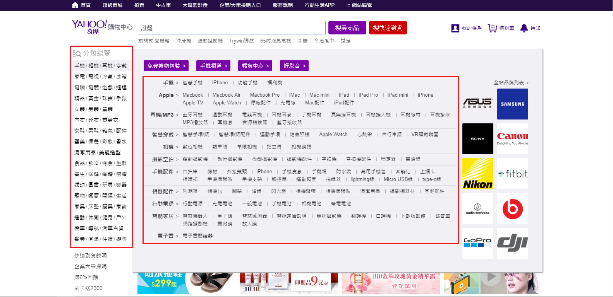
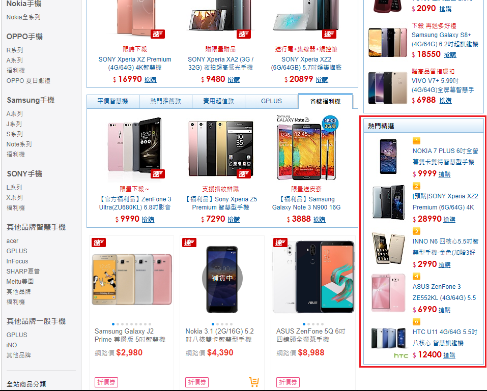

# Bestsellers Crawler
A web crawler which can fetch the Bestsellers on Yahoo Shopping Mall platform

### Quickstart
Python version >= 3.4  
Packages: requests, beautifulsoup4, asyncio, aiohttp, pandas, openpyxl
```
# Install the required packages
pip install -r requirements.txt

# Run the program
python main.py
```
  
  
### Crawler Feature
- Parse latest bestsellers with category, title and price info
- Export result as .csv and .xlsx (stored in *result* folder)
  
  
### Bestsellers on Yahoo Shopping Mall
1. A category menu shows on the left of Home page.
2. A popup menu is attched to each category.
3. Enter every category link to find further information
  

  
4. There is a HOT PICKS section at the right bottom corner of the category page  
5. Fetch the products as bestsellers  
  


### Limitations
- The crawler is dependent on current website structure.
- There are other pages that contain bestseller info but exclude in this crawler.
- The crawler takes about 1 min to parse about 150 links
